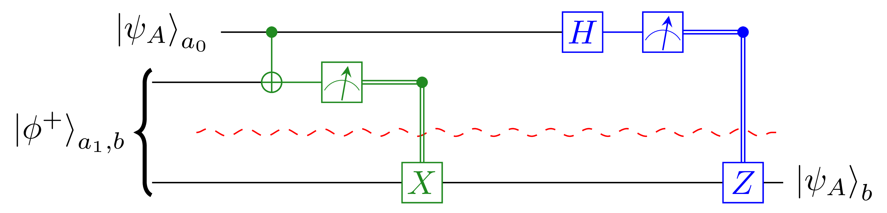
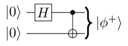
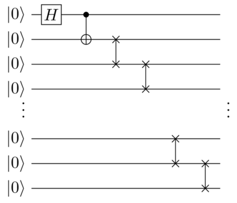
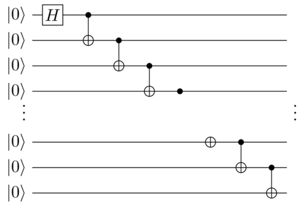

# Assignment 2 — Multi-Qubit Circuits & Early Algorithms

**Submission:** After the deadline, you will no longer have access to this Git repository. See **Section 3.1** of this PDF for the required deliverables to include in this repository.

***

## 1 — Learning Objectives

By completing this assignment, you will be able to:

1. **Reason with and manipulate** multi-qubit circuits to achieve an intended outcome
2. **Implement and verify** quantum algorithms/protocols on simulators and on hardware, based on your own circuit design.
3. **Understand** the fundamental building blocks of quantum circuit distribution

***

## 2 — Development Environment & Software Stack

For GitHub Codespaces, you need to create a new codespaces based on this repository.
For a local setup, you may use the same programming environment as assignment 1, but make sure to clone this repository.
If you install other packages to your environment, please make sure that your pixi.toml and pixi.lock files are up-to-date, clearly state so at the end of your submission document.

For this assignment, you may use the software stack of your choice.

***

## 3 — Questions (Total = 70)

All questions will have a mix of paper-only and coding questions.

***

### 3.1 — Deliverables

#### **Create:**

* `paper/answers.pdf` containing answers, circuit diagrams, plots, and short discussions for the relevant questions. 

#### Include your code in the src/ directory.

You may use any file structure within src/, but we suggest the following:

* `src/Q1_bc.py`
* `src/Q2_b.py`
* `src/Q2_c.py`
* `src/Q3.py`

which would imply the following file structure:

```bash
<your-repository>/
├── paper/
│   └── answers.pdf
└── src/
    ├── Q1_bc.py
    ├── Q2_b.py
    ├── Q2_c.py
    └── Q3.py
```

Do no touch the files in `tests/`, `.devcontainer/`, `random_seed.yaml` or any other files/folders not mentioned above. We will automatically detect the submission that have modified forbidden files and may penalize them.

There are no automated tests for this assignment.

***

### Q1 — Quantum Teleportation Part 1 (20 pts)

The following is the quantum state teleportation circuit as seen in class, which implements the teleportation of a quantum state from Alice to Bob using an e-bit $|\phi^+\rangle$ of pre-shared entanglement: 

{ width=50% }

#### A) (5 pts)

Using quantum teleportation, design a circuit that can apply the two qubit gate $CX$ between a state held by Alice and a state held by Bob. Alice and Bob can have pre-shared entanglement and can communicate classically.

Explain your scheme with a diagram.

#### B) (5 pts)

Write an implementation of your scheme using the software stack of your choice.

The default choice would be python & qiskit which can be installed in this notebook with `!pip install qiskit`. Small bonus points for choosing a non-qiskit stack, though please be clear on how to build & run your code and on which results correspond to which code if not using a jupyter notebook.

You can implement the initialization of $|\phi^+\rangle$ as 

{ width=25% }

#### C) (5 pts)

Evaluate your implementation on a reasonable amount of input states, enough to show that your gate works as expected (including when Alice or Bob's input is in superposition).
Include plots/data for both noiseless results and noiseful results.

#### D) (5 pts)

Suppose that instead of the EPR state $|\phi^+\rangle$ being used as an e-bit for quantum teleportation, Alice and Bob instead pre-shared the state $|\phi'\rangle := \frac{1}{2} \left( |00\rangle + |01\rangle + i|10\rangle -i |11\rangle \right)$.

How can you design a circuit that implements quantum teleporation when the pre-shared entangled state is $|\phi'\rangle$ by only changing the classically controlled gates in the traditional teleportation circuit? Draw a diagram to explain your solution.

***

### Q2 — Quantum Teleportation Part 2 (25 pts)

#### A) (10 pts)

Design a circuit that behaves identically to Q1-A, but that uses only a single e-bit (i.e. a single pre-shared $|\phi^+\rangle$)?

Hint: Use the same gates as quantum teleportation, but arranged differently.

#### B) (5 pts)

As in Q1-B, implement and benchmark your Q2-A circuit.

#### C) (10 pts)

Re-benchmark Q1-B and Q2-B, but with a variable distance between Alice Bob over which they need to preshare entanglement. 
Plot and command on accuracy of the non-local gate over distance, and try to tease out a relationship.

The entanglement pre-sharing can be done with any subcircuit you want. For example, you can do a swap-based sharing

{ width=25% }

or a CX-based long-range entanglement subcircuit

{ width=25% }

***

### Q3 — Title (25 pts)

Pick a quantum algorithm of your choice, and implement in a local and in a distributed manner, using state teleporations (Q1-A) or gate teleportations (Q2-A).
Make sure to clearly describe your algorithm and an appropriate success metric.
Obvious suggestions are the algorithms described in class (Deutsch, Deutsch-Josza, Berstein-Vazirani, etc.), but I encourage you to explore other algorithms.

Run the algorithm for different input sizes until the metric dips too low or the algorithm takes too much time. 
Plot your results.
