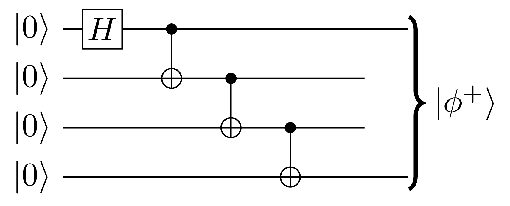

# Assignment 2 — Multi-Qubit Circuits & Early Algorithms

**Submission:** We will count the last commit before the deadline as your submission. See **Section 3.1** of this PDF for the required deliverables to include in this repository.

***

## 1 — Learning Objectives

By completing this assignment, you will be able to:

1. **Reason with and manipulate** multi-qubit circuits to achieve an intended outcome
2. **Implement and verify** quantum algorithms/protocols on simulators, based on your own circuit design
3. **Understand** quantum teleportation, the fundamental building block of distributed quantum circuits

***

## 2 — Development Environment & Software Stack

As in assignment 1, you may chose to use GitHub Codespaces or a local development environment.

* For GitHub Codespaces, you need to create a new Codespace based on this repository.

* For a local setup, you may use the same method as in Assignment 1 with Pixi. Install dependencies with `pixi install`, optionally add a dependency with `pixi add [--pypi] <packagename>`. Run your code with `pixi run python <scriptname>`, you can also use `pixi shell` to open a shell with all dependencies installed, and then run your code normally with `python <scriptname>`.

If you install additional packages in your environment, please make sure to keep your `pixi.toml` and `pixi.lock` files up to date on GitHub so we can recreate your environment and run your code (they are automatically updated when you use `pixi add ...`). Clearly state any modifications you made at the end of your submission document.

For this assignment, you are recommended to use Qiskit.
You may also choose Pennylane or another Python package, but make sure you know how to implement a noisy simulation using that software stack.

***

## 3 — Questions (Total = 70)

All questions will have a mix of pen-and-paper style questions and coding questions.

***

### 3.1 — Deliverables

#### **Create:**

* `paper/answers.pdf` containing answers, circuit diagrams, plots, and short discussions for the relevant questions. 

#### Include your code in the src/ directory.

You may use any file structure within src/, but we suggest the following:

* `src/Q1_bc.py`
* `src/Q2_b.py`
* `src/Q2_c.py`
* `src/Q3_b.py`
* `src/Q3_d.py`

which would imply the following file structure:

```bash
<your-repository>/
├── paper/
│   └── answers.pdf
└── src/
    ├── Q1_bc.py
    ├── Q2_b.py
    ├── Q2_c.py
    ├── Q3_b.py
    └── Q3_d.py
```

Do no touch the files in `.devcontainer/`.

There are no automated tests for this assignment

***

### Q1 — Quantum Teleportation Part 1 (25 pts)

The following is the quantum state teleportation circuit as seen in class, which implements the teleportation of a quantum state from Alice to Bob using one unit $|\phi^+\rangle$ of pre-shared entanglement: 

{ width=75% }

#### A) (pen-and-paper, 5 pts)

Using quantum state teleportation as a building block, design a circuit that can apply the two qubit gate $CX$ between a state held by Alice and a state held by Bob. Alice and Bob can have pre-shared entanglement and can communicate classically.

Explain your scheme with a diagram, and going through the steps of the protocol in your own words.

Note: As you will see in Q2, this is also possible without directly using quantum state teleportation. However, in this question (Q1), you *must* use the quantum state teleportation diagramed above as a building block. You will be using two units $|\phi^+\rangle$ of pre-shared entanglement.


#### B) (coding, 5 pts)

Write an implementation of your scheme using Qiskit, which is already part of the provided Pixi environment. Please be clear about how to run your code, and which results correspond to which code.

You can implement the initialization of $|\phi^+\rangle$ as the following:

{ width=25% }

#### C) (coding, 5 pts)

Evaluate your implementation on a reasonable amount of input states, enough to show that your gate works as expected, i.e., show that the final state is close to the expected output state after applying $CX$ between Alice and Bob's qubits directly.
Include plots/data for both noiseless simulation results and noiseful simulation results.
For an example of how to do a noisy simulation, refer to `examples/aer_simulator_examples.py`. 

#### D) (pen-and-paper, 10 pts)

Suppose that instead of the EPR state $|\phi^+\rangle$ being used as a pre-shared resource state in quantum teleportation (Fig. 1), Alice and Bob instead pre-shared the state $|\phi'\rangle := \frac{1}{\sqrt{2}} \left( |+\rangle |-i\rangle + i |-\rangle |i\rangle \right)$. 
(Recall $|\pm\rangle = \frac{1}{\sqrt{2}} \left( |0\rangle \pm |1\rangle \right)$ and $|\pm i\rangle = \frac{1}{\sqrt{2}} \left( |0\rangle \pm i|1\rangle \right)$.)

How can you design a circuit that implements quantum teleporation when the pre-shared entangled state is $|\phi'\rangle$ instead of $|\phi^+\rangle$ ? Draw a diagram and explain your solution.

Hint: Starting from the traditional teleportation circuit (Fig. 1), you may need to change the two-qubit gate (from a controlled-not gate $CX$ to some other controlled unitary $CU$), and/or change the classically controlled gates (from controlling $X$ and $Z$ to controlling some other gates), and/or change the placement of $H$ gate(s). 
It may help to closely study the derivation showing quantum teleportation works, so that you can derive a similar result for your version of quantum teleportation.

***

### Q2 — Quantum Teleportation Part 2 (25 pts)

#### A) (pen-and-paper, 10 pts)

Design a circuit that behaves identically to Q1-A (applying $CX$ between a state held by Alice and a state held by Bob) but that uses only a single pre-shared $|\phi^+\rangle$.

Explain your scheme with a diagram, and going through the steps of the protocol in your own words.

Hint: Use the same gates as quantum teleportation, with the addition of a single CX gate. 

Hint 2: Consider the fact that the quantum teleportation circuit in Fig. 1 is split into a green part and a blue part.

#### B) (coding, 5 pts)

As in Q1-B, implement and benchmark your Q2-A circuit.

#### C) (coding, 10 pts)

In this part, you will observe how quantum teleportation schemes perform when the pre-shared entanglement is generated with varying levels of noise.
In a real setting, this noise would come from physical processes, for example depolarization of photons in the fiber optic cables that are used to generate entanglement between Alice and Bob.

We will simulate these varying levels of noise by replacing the CNOT gate in the circuit generating $|\phi^+\rangle$ by a chain of CNOT gates of varying length.
For example, while Q1-B showed entanglement sharing with a length-1 CNOT chain, the length-3 equivalent would look like the following:

{ width=25% }

(Note that we are discarding the middle qubits when stating that the output state is $\phi^+\rangle$).
Longer chains should lead to noisier EPR pairs, as circuit noise depends in part on the number of gates.

You are tasked with benchmarking both teleportation schemes as in Q1-B and Q2-B, but generating your EPR pairs with varying CNOT chain lengths.
Plot the accuracy of your non-local gate as a function of this distance and comment on what you observe.

***

### Q3 — A Distributed Quantum Algorithm (both pen-and-paper and coding, 25 pts)

#### Background

An interesing research area in quantum computing is that of distributed quantum computing.
Suppose Alice and Bob each have access to their own small quantum computer and they want to distribute a quantum algorithm across both computers.
If they can pre-share entanglement between their computers, they are then able to use quantum state teleportation (Q1-A) and quantum gate teleportation (Q1-B) to manipulate quantum information across their quantum computers.

#### A) (pen-and-paper, 5 pts)

Pick a quantum algorithm of your choice that you will implement once in a non-distributed manner and once in a distributed manner.
Make sure to clearly describe your algorithm and give an appropriate success metric.
Obvious suggestions are the algorithms described in class (Deutsch-Josza, Berstein-Vazirani, etc.), but we encourage you to explore other algorithms.

#### B) (coding, 5 pts)

First, implement the non-distributed version of your algorithm.

#### C) (pen-and-paper, 5 pts)

Take your algorithm and distribute it across two quantum computers.

That is, you should designate half your qubits to belong to Alice, and the other half to belong to Bob, and use quantum state teleportations (Q1-A) or gate teleportations (Q2-A) to split you circuit across Alice's and Bob's qubits, for an arbitrary number of qubits.
There should be no two-qubit gates between Alice's qubits and Bob's qubits other than those to generate shared entanglement $|\phi^+\rangle$.

Explain how you turn your algorithm into a distributed algorithm, preferably with a diagram.

#### D) (coding, 10 pts)

Run both versions of your algorithm  (distributed and non-distributed) for different input sizes until your success metric dips too low or the algorithm takes too much time. 
Plot and discuss your results.
